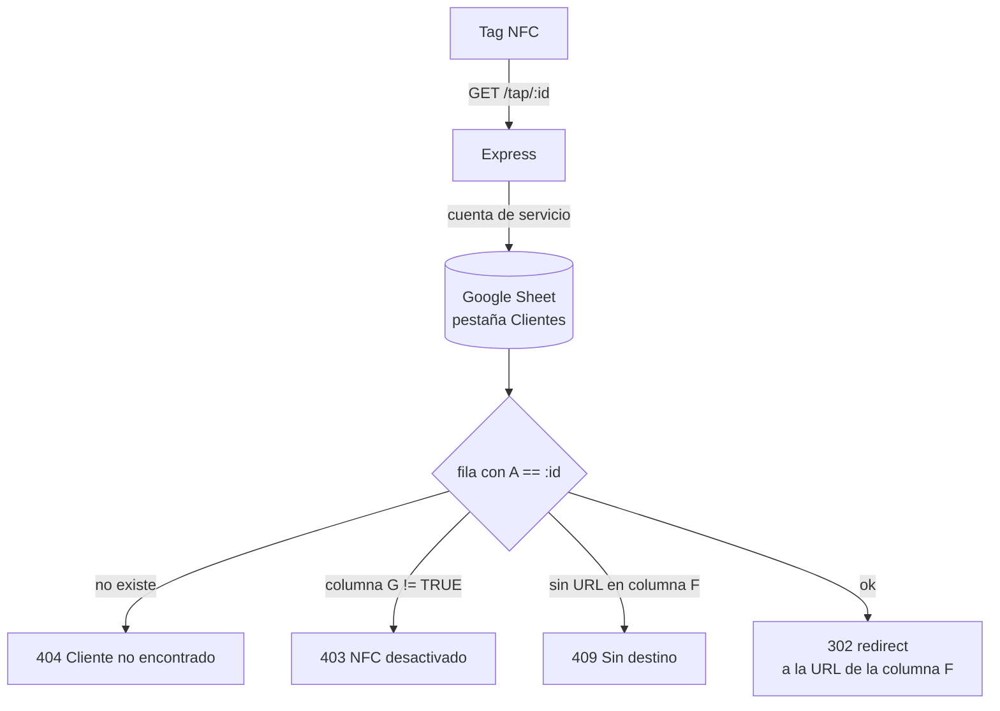

# EasyTap — NFC redirect server


API mínima en **Express** que resuelve las redirecciones de los tags NFC de
[EasyTap](https://easytap.mx). Cada tag apunta a `https://<host>/tap/<id>`; el
servidor busca ese `id` en una hoja de Google Sheets y redirige a la URL que el
negocio tenga configurada (su menú, WhatsApp, reseñas de Google, etc.).

Usar una hoja de cálculo como "base de datos" permite que el negocio actualice
su destino sin tocar código ni volver a programar el tag.

## Cómo funciona



## Qué demuestra este proyecto

- API REST pequeña y bien separada: `routes → controllers → services → config`.
- Integración con la **Google Sheets API** mediante una **cuenta de servicio**
  (`googleapis`, credenciales por variable de entorno, sin archivos secretos en
  el repo).
- Manejo de errores con códigos HTTP significativos (404 / 403 / 409 / 502).
- Configuración por entorno (`dotenv`), endpoint `/health`.

## Stack

Node.js · Express 5 · googleapis · dotenv

## Primeros pasos

```bash
npm install
cp .env.example .env     # completar SPREADSHEET_ID y GOOGLE_CREDENTIALS
npm run dev
```

Probar: <http://localhost:3000/tap/DEMO123>

## Estructura de la hoja "Clientes"

| Columna | Contenido |
|---|---|
| A | ID del tag NFC (lo que va en la URL) |
| F | URL de destino |
| G | `TRUE` / `FALSE` — si el tag está activo |

(El resto de columnas se usan para datos internos del negocio.)

## Licencia

[MIT](./LICENSE)
